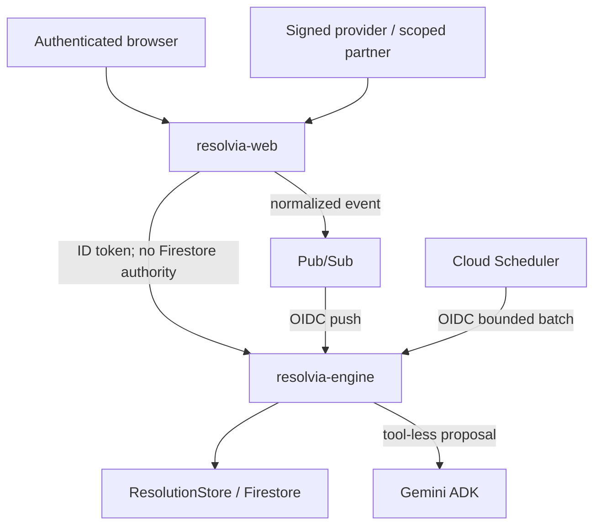

# Resolvia architecture

ResolutionStore is the only authoritative mutation boundary. Case mutation, audit, provider transaction, event receipt, and automation outbox creation are atomic. The Truth Graph is rebuilt from stored claims/evidence; it never writes truth. Gemini receives a bounded case projection, has no tools, and can append only a version-pinned AgentRun through deterministic validation.

The partner portal sees only request ID, case display ID, requested evidence type, and expiry. It sends a scoped token and structured response to the private engine; only a digest is stored. After publication, portal context access closes while an identical structured submission may retry the same event ID. A broker-uncertain result retains `PUBLISHED`, so accepted deliveries remain valid and duplicate deliveries have one semantic effect.

Signed Demo Provider ingress uses a transactional HMAC-only replay receipt before Pub/Sub publication. One live lease exists per nonce; successful publication marks the receipt duplicate, failed publication releases it for retry, and a conflicting payload/semantic ID fails closed. The raw nonce, body, and signature are not stored.

Automation uses deterministic keys, pending/leased/retryable/terminal states, expiry recovery, attempt caps, and owner-bound completion. It may analyze, recalculate safe guidance, or evaluate resolution. It cannot move money, refund, contact arbitrary recipients, file claims, or perform an irreversible external action.
