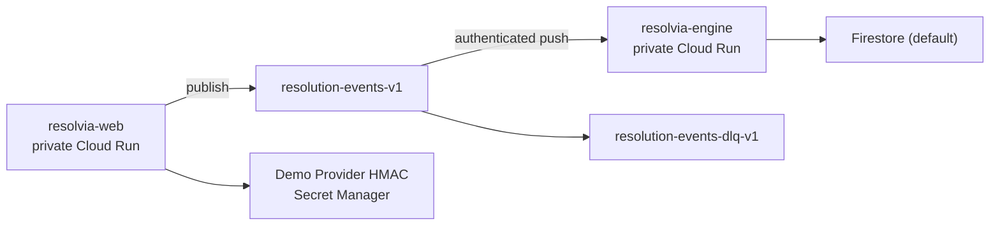

# Phase 6 private Google Cloud runbook

This runbook records the private Phase 6 backbone. Later G8/G9/G10/G13 authority is documented separately; it still does not authorize public exposure, production authentication, merge, tag, upload, or submission.

## Scope

The topology is deliberately small:



`resolvia-web` uses the `resolvia-web` service account. It publishes to `resolution-events-v1`, accesses only its scoped secrets, reads/writes the approved Firestore data path, and invokes only the private engine for partner mediation. `resolvia-engine` persists connected mutations and alone accesses `resolvia-gemini-api-key`. Engine invokers are limited to `resolvia-pubsub-push`, `resolvia-web`, and the dedicated `resolvia-scheduler`; there is no public invoker.

Both services remain private and anonymous traffic is denied. Approved service identities invoke only their required private engine routes.

## Preconditions

- Active `gcloud` account and Application Default Credentials point to `your-gcp-project`.
- Billing and required APIs have already been approved and enabled.
- The `resolvia-demo-provider-hmac` secret already exists in Secret Manager. Do not read, print, copy, or put its value in an `.env` file.
- The working tree contains only intentional Task 6.6 changes. Do not stage `AGENTS.md` or alter `sources/`.

Run the non-mutating preflight first:

```powershell
.\infra\google\preflight.ps1 -ProjectId your-gcp-project -Region asia-southeast2
```

## Deploy

Deploy the current commit through Cloud Build:

```powershell
.\infra\google\deploy.ps1 -ProjectId your-gcp-project -Region asia-southeast2
```

The script tags the image with the current commit, deploys the two private Cloud Run services, configures a one-day ordered Pub/Sub subscription with a five-attempt dead-letter policy, and assigns only the required Resolvia resource-scoped roles. It never creates service-account keys or public unauthenticated access.

For a retry after a verified build image already exists, use the explicit build skip switch:

```powershell
.\infra\google\deploy.ps1 -ProjectId your-gcp-project -Region asia-southeast2 -SkipBuild
```

Do not add project-wide Owner, Editor, Artifact Registry Admin, Storage Admin, unrestricted Secret Manager access, or public Cloud Run access to work around a failure. Report the exact missing permission for review instead.

## Verify the private deployment

Confirm both services use the expected runtime identities and `CONNECTED` environment configuration. Verify their effective revision settings: min instances defaults to `0`, max instances is `2`, concurrency is `20`, timeout is `60` seconds, and CPU throttling is enabled.

Verify the subscription `resolution-engine-v1` has ordered delivery, a 60-second acknowledgement deadline, 10–600-second retry backoff, 24-hour retention, a five-attempt dead-letter policy, and OIDC push to the engine URL using `resolvia-pubsub-push`. Verify `resolution-events-dlq-review-v1` has no push endpoint and one-day retention.

Smoke `/api/health` with the approved operator identity. The response must report `mode: CONNECTED`, `firestoreReady: true`, and `pubsubReady: true`. Anonymous calls to either service must be denied. Do not treat the deployment smoke as proof of provider delivery: the signed connected event and duplicate replay belong to Task 6.7.

## Roll back traffic

List revisions, select a known-good private revision, then shift traffic deliberately:

```powershell
.\infra\google\rollback.ps1 -Service resolvia-web -Revision <known-good-revision> -ProjectId your-gcp-project -Region asia-southeast2
.\infra\google\rollback.ps1 -Service resolvia-engine -Revision <known-good-revision> -ProjectId your-gcp-project -Region asia-southeast2
```

This changes traffic only. It does not delete images, services, topics, subscriptions, secrets, or Firestore documents. Any deletion requires the separate cleanup authorization gate.

## Cost and safety limits

The deployment uses scale-to-zero Cloud Run services, a single regional Artifact Registry repository, one existing Firestore database, one small Secret Manager secret, and short Pub/Sub retention. Do not increase minimum instances, max instances beyond `2`, retention, backups/PITR, topic/subscription count, or add public traffic/load tests without explicit cost and exposure approval.